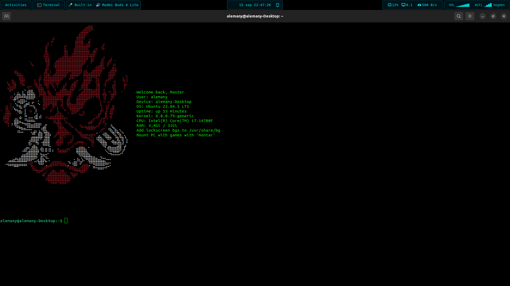

# ASCII Greeter

Bring your linux terminal to life with ASCII art and system information every time you open it!  
This project installs a small setup that prints colorful ASCII drawings alongside useful system info when a new terminal session starts.

---

## 📌 Purpose

The goal of this repository is to:

- Display a random ASCII art file each time you open your terminal.
- Show useful system information (user, hostname, OS, uptime, kernel, CPU, RAM, battery, etc.) next to the art.
- Optionally configure:
  - A **custom shortcut** (`Ctrl + Alt + T`) that always opens the terminal maximized.
  - An **autostart entry** that opens a maximized terminal automatically after login.

---

## 🚀 Installation (only tested on Ubuntu 22)

1. Clone the repository:

git clone https://github.com/adrialemany/ascii-greeter.git ~/ascii-greeter  
cd ~/ascii-greeter  

2. Run the installer:

./LAUNCH_ME.sh  

3. Follow the prompts:  
   - Add the greeter to `.bashrc`.  
   - Configure the maximized terminal shortcut (optional).  
   - Enable autostart at login (optional).  

---

## ⚙️ How it works

There are three main scripts:

1. **LAUNCH_ME.sh** (the only script you need to launch)
   The installer.  
   - Adds a block to your `~/.bashrc` that runs the greeter on every new terminal session.  
   - Asks if you want to configure `Ctrl + Alt + T` to always open a maximized terminal.  
   - Optionally creates a `.desktop` autostart entry to launch a maximized terminal at login.  

2. **scripts/launch-terminal-maximized.sh**  
   A helper script that launches a maximized GNOME Terminal window.  
   Used by the custom shortcut and autostart configuration.  

3. **scripts/.ascii-welcome.sh**  
   The core greeter.  
   - Chooses a random `.txt` file from `~/ascii-greeter`.  
   - Cleans formatting, calculates text widths, and aligns ASCII art with system info.  
   - Displays system information such as:
     - Username
     - Hostname
     - OS
     - Uptime
     - Kernel
     - CPU
     - RAM usage
     - Battery percentage (if available on laptops)

---

## 🎨 Adding ASCII art

- Place `.txt` files containing ASCII art in the root of the repository (`~/ascii-greeter`).  
- Each time you open a terminal, one of them will be chosen randomly.  
- If no `.txt` files are found, only system info will be displayed.

---

## 🌈 Coloring ASCII art

You can embed ANSI escape codes in your `.txt` files to add colors.  
The syntax looks like this:

- \033[31m → Red  
- \033[97m → Bright White  
- \033[0m → Reset to default  

Example inside a `.txt` file:

\033[31m   ██████╗  █████╗ ██████╗ \033[0m  
\033[31m   ██╔══██╗██╔══██╗██╔══██╗\033[0m  
\033[97m   ██║  ██║███████║██████╔╝\033[0m  
\033[97m   ██║  ██║██╔══██║██╔═══╝ \033[0m  
\033[31m   ██████╔╝██║  ██║██║     \033[0m  
\033[31m   ╚═════╝ ╚═╝  ╚═╝╚═╝     \033[0m  

This will render the ASCII drawing in red and white.  
Always close colored sections with \033[0m to avoid affecting later text.

---

## 🔋 Battery percentage

If your system has a battery (laptop), the greeter automatically detects it using `upower` and shows the percentage.  

If you want it to appear in the info block, simply add this line to `sys_info_lines` inside `scripts/.ascii-welcome.sh`:

"Battery: $battery_percent"

---

## 🛠️ Customization

- **Add or remove ASCII art**: put `.txt` files in the repository root.  
- **Change system info text**: edit `scripts/.ascii-welcome.sh`, modify the `sys_info_lines` array.  
- **Set color overrides**: specific `.txt` filenames can trigger color schemes inside `.ascii-welcome.sh`.

---

## 📧 Feedback

Suggestions or improvements?  
Feel free to open an issue or send an email: **al426695@uji.es**

---

## 📷 Example Output

When you open a new terminal, you’ll see something like this:

                             
---

Enjoy your personalized terminal experience! 🎉
